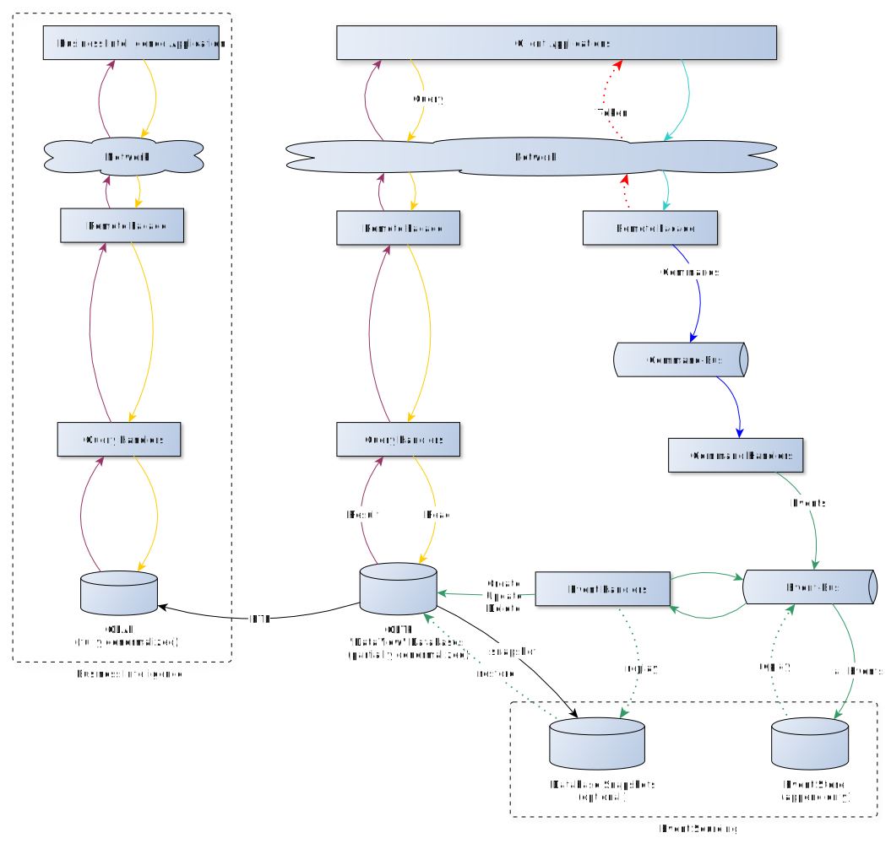

# Command Query Responsibility Seggragation

## Key concepts

 * A *clear* separation of 
   * Commands
   * Queries
   * Read Repositories
   * Write Repositories
 * Projections / Building the Read Model Data

## Overview

In theory, this could be a *possible* implementation. The diagram has been taken from the german Wikipedias CQRS article and is just meant to illustrate the position of the different elements of CQRS.



## Commands

Commands are simple [Data Transfer Objects](https://en.wikipedia.org/wiki/Data_transfer_object), that by definition, don't contain any logic. They're carrying the required data to fulfill a task from the input layer to the next layer.

### Example (Pseudo Code)

```php
use App\Domain\Accounting\Command\CreateAccount;

$commandBus->dispatch(CreateAccount::fromRequest($request));
```

## Queries

It's basically another kind of command or message, similar to a command, that describes the information needed to query a read repository.

### Example (Pseudo Code)

```php
use App\Domain\Accounting\Query\PaginateAccounts;
use App\Infrastructure\Repository\AccountsRepository;

$repo = new AccountsRepository();
$query = PaginateAccounts::fromRequest($request)
    ->withLimit(20);
$repo->paginate($query);
```

## Repositories

### Write Repositories

A write repository is usally saving the events that were applied to an *Aggregate*.

A write repository can restore the Aggregate, or better it's state, by reading past events and re-applying them to the Aggregate, to restore a certain state of the Aggregate.

Keep in mind that Aggregates represent the state of a business operation.

### Read Repositories

Read repositories **don`t** write any change of state at all. Never. Period.

A read repositories only duty is to answer queries by returning something that was requested.

Depending on philosophy and bias it is totally up to the developers what these repositories return.

Our recommendation and opion is it to have the interface that describes the repository grouped together with your domain model, but to have the actual implementation in your infrastructure layer, because it is a concrete implementation while your domain model has (some say should) to be agnostic to the implementation. Example:

### Example

A *possible* namespace / class names for the two different repositories.

 * App\Domain\Users\Repository\Read\UserRepositoryInterface
 * App\Domain\Users\Repository\Write\UserRepositoryInterface
 * App\Infrastructure\Repository\Read\UserRepository
 * App\Infrastructure\Repository\Write\UserRepository

## Projections

Think of projections as data transformers for event data. Projections read the incoming events that are passed to the store and it's up to the projection to transform and store the event data in a data store system of their choice. This can be a document database like Elastic Search, MongoDB or a relational SQL DB or even a simple file.

A single projection could, in theory, write to one or many different data storage systems. So you can restructure you data and write it normalized to a SQL database and at the same time in a different structure to a document store.

The great thing about projections is, that you can run them at any time again, over and over. So if you need to build a specialzed report just create a new projection and run them on the events you need for it to produce a new read model with the data you need in the way you need it.

## References

 * [Martin Fowler: CQRS](https://martinfowler.com/bliki/CQRS.html)
 * [CQS Wikipedia](https://en.wikipedia.org/wiki/Command%E2%80%93query_separation)
 * [Di Dahan: Clarified CQRS](http://udidahan.com/2009/12/09/clarified-cqrs/)
 * [Three-tier architecture](https://en.wikipedia.org/wiki/Multitier_architecture#Three-tier_architecture)
